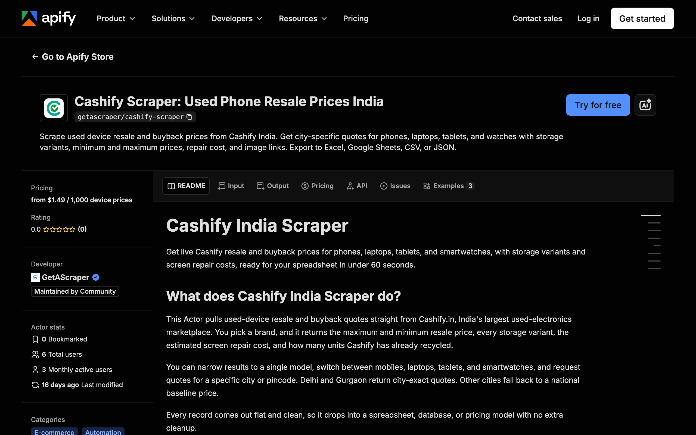

<div align="center">

# Cashify Scraper: Used Device Resale Prices

[](https://apify.com/getascraper/cashify-scraper)
[](https://apify.com/getascraper/cashify-scraper)
[](https://apify.com/getascraper/cashify-scraper)
[](https://github.com/getascraper/how-to-scrape-cashify/issues)
[](https://github.com/getascraper/how-to-scrape-cashify/commits/main)

Scrape used device resale and buyback prices from Cashify India. Get city-specific quotes for phones, laptops, tablets, and watches with storage variants, minimum and maximum prices, repair cost, and image links. Export to Excel, Google Sheets, CSV, or JSON.

[](https://apify.com/getascraper/cashify-scraper)

</div>

---

## Why use Cashify Scraper

* **City-exact buyback quotes**: Get regional resale prices for Delhi and Gurgaon, with a clear national baseline for every other city.
* **Every storage variant in one row**: See the minimum and maximum price across every storage option for a model, no manual clicking through pages.
* **Repair cost included**: Each record carries the estimated screen repair cost, so you can weigh a repair against a straight sale.
* **Covers four device categories**: Pull prices for mobile phones, laptops, tablets, and smartwatches from a single Actor.
* **Clean, flat rows**: Every record is ready for a spreadsheet, database, or pricing model with no extra formatting.

---

## How to use Cashify Scraper

1. **Pick a brand and category**: Enter a brand such as apple, samsung, or xiaomi, and choose mobile, laptop, tablet, or smartwatch.
2. **Set a city and pincode**: Choose the Indian city and pincode you want quotes for, so prices match your target market.
3. Click **Start**: The actor collects every matching record and writes one flat row per item.
4. **Download your results**: Export as Excel, CSV, JSON, or HTML from the Output tab.

---

## Input

| Field | Type | Required | Description |
| --- | --- | :---: | --- |
| `brand` | string | Yes | Device brand to fetch quotes for, such as apple, samsung, or xiaomi. |
| `model` | string | No | Optional model name to narrow results, such as iphone 13. Leave blank to return every model for the brand. |
| `category` | enum | No | Device category to search: mobile, laptop, tablet, or smartwatch. Defaults to mobile. |
| `city` | string | No | Indian city to price against. Delhi and Gurgaon return city-exact prices, other cities use a national baseline. |
| `pincode` | string | No | Delivery pincode used to localize the buyback quote, such as 110001 for Delhi or 122001 for Gurgaon. |
| `maxItems` | integer | No | The most device records to return in one run. |
| `proxyConfiguration` | object | No | Connection settings. India-based coverage is required to return real, region-accurate prices. |

---

## Output

Each row in your dataset is one device with its resale value, storage variants, and region. All fields are flat with no nested data, so the file opens cleanly in any spreadsheet program.

```json
{
  "title": "Sell Old Apple iPhone 6S",
  "brand": "APPLE",
  "city": "Gurgaon",
  "price": 9010,
  "price_min_inr": 6610,
  "repair_price_inr": 1499,
  "units_recycled": 48230,
  "variants_count": 4,
  "variants_summary": "16 GB:6610 | 32 GB:7890 | 64 GB:8450 | 128 GB:9010",
  "variants": "[{\"name\":\"16 GB\",\"price\":6610},{\"name\":\"32 GB\",\"price\":7890},{\"name\":\"64 GB\",\"price\":8450},{\"name\":\"128 GB\",\"price\":9010}]",
  "currency": "INR",
  "image_url": "https://www.cashify.in/images/sell/apple-iphone-6s.png",
  "product_url": "https://www.cashify.in/sell-old-mobile-phone/apple/iphone-6s",
  "scraped_at": "2026-06-25T09:14:02.318Z"
}
```

### Data table

| Field | Type | Description |
| --- | :---: | --- |
| `title` | string | The listing title, such as "Sell Old Apple iPhone 6S". |
| `brand` | string | The device brand in uppercase, such as "APPLE". |
| `city` | string | The region the quote applies to, such as "Gurgaon". |
| `price` | number | The maximum resale or buyback price in Indian rupees. |
| `price_min_inr` | number | The minimum resale price in Indian rupees. |
| `repair_price_inr` | number | The estimated screen repair cost in Indian rupees. |
| `units_recycled` | number | How many of this device Cashify has recycled to date, a demand signal. |
| `variants_count` | number | The number of storage variants available for this device. |
| `variants_summary` | string | A readable summary of each storage variant and its price. |
| `variants` | string | A JSON array of per-variant prices for deeper analysis. |
| `currency` | string | The price currency, always "INR". |
| `image_url` | string | A direct link to the product image. |
| `product_url` | string | The Cashify product page URL for this device. |
| `scraped_at` | string | The timestamp the record was captured, in ISO format. |

---

## Pricing

**$1.99 per 1,000 results. The first 50 results of every run are completely free.** No monthly subscriptions and no minimum commits.

You only pay for each device record successfully saved to your dataset, billed under the "Device price" event. A typical run of 100 device records completes in under 60 seconds.

---

## Quick start

Create a `.env` file from `.env.example`, add your [Apify API token](https://console.apify.com/account/integrations), and run:

```bash
npm install
npm start
```

The script uses the [Apify API client](https://docs.apify.com/api/client/js/) to start the actor and fetch results.

---

## Tips and optimization

* **Set city and pincode together**: Cashify buyback offers change by region, so pairing a city with its matching pincode gives the most accurate quote.
* **Narrow by model when you can**: Adding a model name cuts run time and keeps your dataset focused on the devices you actually price.
* **Schedule regular runs**: Resale prices on Cashify move often, so a recurring schedule keeps your pricing data current.
* **Use maxItems to control cost**: Cap the number of records per run to match your budget and only collect what you need.

---

## FAQ

**Why do prices differ by city?**
Cashify buyback offers change from one region to the next. Delhi and Gurgaon return city-exact quotes, while other cities fall back to a national baseline. Set the city and pincode to match the market you care about.

**How fresh is the resale price data?**
Every record is pulled live from Cashify at the moment you run the Actor. Resale prices move often, so running the scraper on a schedule keeps your own pricing and comparisons current.

**Which devices and brands are supported?**
The scraper covers mobiles, laptops, tablets, and smartwatches across the brands Cashify lists, including Apple, Samsung, and Xiaomi. Set the brand and category in the input, and optionally a model, to choose what you collect.

**Can I export straight to Google Sheets?**
Yes. The Output tab lets you export results directly to Excel, Google Sheets, CSV, or JSON with one click.

---

## Support

For bug reports, missing fields, or feature requests, open an issue under the [Issues](https://github.com/getascraper/how-to-scrape-cashify/issues) tab.
